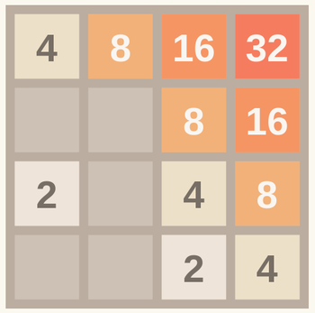
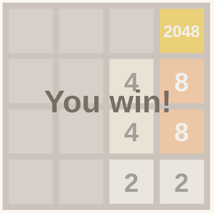
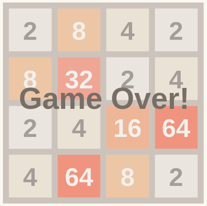

## 2048 in OCaml

(Gothenburg, September 2014)

### The goal



The aim of this session is to write an implementation of the popular game [2048](http://gabrielecirulli.github.io/2048/).

The basic types and stub functions are provided, along with a suite of failing tests and a front-end that runs the game in a browser.  Your task is to implement the game logic in OCaml.

### Preparation

We'll start with a brief introduction to OCaml, with a tour through the parts of the language that you'll need for this session.  We've also prepared IOCaml notebooks available to guide you through these fundamental language constructs.  Once you've completed the notebooks you'll be ready to jump into implementing the game.

#### Installation

We'll be using a number of OCaml packages for the tutorial.  The easiest way to install the packages is to use OPAM.

```
$ opam switch 4.01.0                                   # install the OCaml 4.01 compiler
$ opam install gg vg react js_of_ocaml ounit qcheck    # Install the named packages and their dependencies
```

In order to run the notebooks you'll need IOCaml

```
$ opam install iocaml
```

IOCaml relies on a couple of non-OCaml libraries: libffi and libzmq.  You should install these using your system's package manager.

#### Running the notebooks

Once you've installed IOCaml, the following command will start the IOCaml server and open the notebooks in your browser.

```bash
$ iocaml notebooks/
```

### Core steps

The outline game logic is in the file `2048/src/g2048.ml`.  

In the directory `2048`, run the command `./build test` to build the code and run the tests.  You should see something like the following output:

```bash
$ ./build test
ocamlfind ocamldep -package js_of_ocaml -package react -package vg -package vg.htmlc -modules src/g2048.mli > src/g2048.mli.depends
[...]
FTTTTTTTTTTTTTTTtesting property Randomly generated full boards are full...
  [✔] passed 1000 tests (0 preconditions failed)
.
==============================================================================
Failure: 2048 tests:0:test is_board_winning
 
A 1x1 board containing 2048 is a winning board
not equal
------------------------------------------------------------------------------
Ran: 17 tests in: 0.00 seconds.
FAILED: Cases: 17 Tried: 17 Errors: 0 Failures: 1 Skip:  0 Todo: 15 Timeouts: 0.
```

#### Step 1: Have you won?



As the output above shows, the tests for whether a board is a winning board are failing.  Your first task is to fix the tests.

* Write a function `is_square_2048` which returns `true` if a square has the value `2048` and `false` otherwise.

* Write the `is_board_winning` function using `is_square_2048`.  The `List.exists` function (which you can try out in an IOCaml notebook) may prove useful.

At this point you should be able to run the tests again to check that your implementation is correct.

#### Step 2: Sliding and merging

The next step is to implement the logic for sliding boards up, down, left and right.

Uncomment the `Shifting` entry in the `tests_enabled` list in `2048/tests/test_enabled.ml` and run the tests again.

* Implement the `shift_left_helper` function in `g2048.ml` to support the left shift action.  You'll need to consider the following cases:

- The row is empty.  There's nothing to do except return the accumulated `empties` list.
- The first square is unoccupied (`None`).  Add it to `empties` and process the rest of the row.
- The first two squares are occupied by equal tiles.  Merge them together, add an entry to the `empties` list, and process the rest of the row.
- The first square is unoccupied, but the second square is unoccupied.  Move the unoccupied square to the `empties` list and reprocess the row.
- The first square is occupied and not covered by the cases above.  Move on to processing the rest of the list.

* Implement the `shift_board` function using `shift_left_helper`.  Hint: how can you implement a right shift in terms of a left shift?  How can you implement an up shift in terms of a left shift?

As before, run the tests again to check your implementation.

#### Step 3: Adding new tiles

The next step is to implement a function for adding new tiles to the board after a move.  Uncomment the `Inserting` entry in `tests_enabled`.

* Implement the `insert_square` function.  You may like to start by implementing a function `insert_into_row`, perhaps using `Utils.replace_one`.  You may find it simplest to simply insert the tile in the first empty space.  There'll be an opportunity for a more realistic implementation in step 6.

There's a minor milestone at this point: if the tests pass then the game should be somewhat playable.  (The sliding animations won't appear until you've completed step 5.)  You can try out the game by loading `2048/_build/src/2048.html` in a browser.

#### Step 4: Is it all over?



You've written have a check for a winning board, but we don't yet have a way to check whether the game has been lost.  The game is lost when it's no longer possible to make a move.

* Write a function `is_complete_row`.  A row is considered complete if there are no empty squares and if a shift leaves it unchanged.

* Using `is_complete_row`, write a function `is_game_over`.  Don't forget to enable and run the tests!

### Extension steps

#### Step 5: Where did this come from?

At this point it's possible to play the game, but the tiles leap disconcertingly around the board rather than sliding smoothly.  Sliding animations require keeping track of where tiles came from: their *provenance*.

* Change the definition of the `tile` type in `g2048.ml` to include provenance:

  ```ocaml
  type tile = int * provenance list
  ```

  You'll need to reorder the type definitions so that `provenance` is defined before `tile`.

* Update the function `square_provenances` to return the actual provenance (where available) rather than an empty list.

* Update the shift functions (`shift_left` etc.) to keep track of provenance.

* Update any other functions (e.g. `string_of_square`) which no longer compile with the new definition of `tile`.

Once the provenance tests pass you can run the game again and see the sliding animations in action!

#### Step 6: Roll the dice

Always inserting squares in the first empty space makes the game much less challenging.  See if you can update `insert_square` to use a random empty position instead (perhaps using `Utils.replace_at`).  Don't forget to check that the tests still pass!
